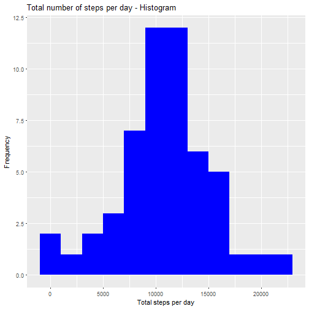
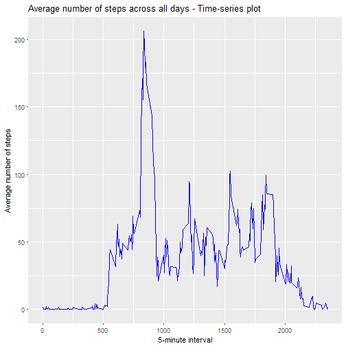
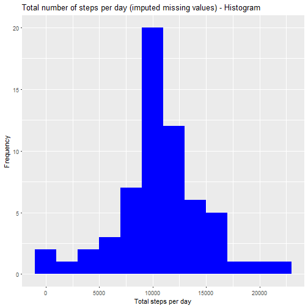
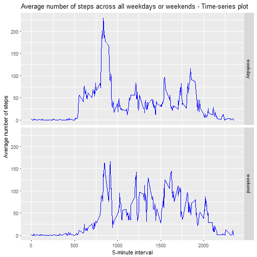

```r
---
title: "Coursera: Reproducible Research"
author: "M"
date: "18 March 2018"
output: html_document
keep_md: true
---
```

```
## Error: <text>:9:0: unexpected end of input
## 7: ---
## 8: 
##   ^
```


# Peer-graded Assignment (Course Project 1)


### Loading and preprocessing the data

1. Load data

load libraries

```r
library(lubridate)
library(dplyr)
library(ggplot2)
```
unzip data set

```r
unzip(zipfile = "activity.zip",exdir = "activity")
```
reset working directory

```r
knitr::opts_knit$set(root.dir = "./activity")
```

read data 

```r
activity <- read.table("activity.csv", sep = ",", header = TRUE)
```

2. Process data

check class of variables

```r
head(activity)
```

```
##   steps       date interval
## 1    NA 2012-10-01        0
## 2    NA 2012-10-01        5
## 3    NA 2012-10-01       10
## 4    NA 2012-10-01       15
## 5    NA 2012-10-01       20
## 6    NA 2012-10-01       25
```

```r
str(activity)
```

```
## 'data.frame':	17568 obs. of  3 variables:
##  $ steps   : int  NA NA NA NA NA NA NA NA NA NA ...
##  $ date    : Factor w/ 61 levels "2012-10-01","2012-10-02",..: 1 1 1 1 1 1 1 1 1 1 ...
##  $ interval: int  0 5 10 15 20 25 30 35 40 45 ...
```
transform date variable

```r
Sys.setlocale("LC_TIME", "English")
```

```
## [1] "English_United States.1252"
```

```r
activity$date <- ymd(activity$date)
```


### What is the mean total number of steps taken per day ?  (ignore the missing values)

1. Calculate the total number of steps taken per day

```r
total_steps_day <- activity %>% na.omit() %>% group_by(date) %>% summarise(total_steps = sum(steps))
head(total_steps_day)
```

```
## # A tibble: 6 x 2
##         date total_steps
##       <date>       <int>
## 1 2012-10-02         126
## 2 2012-10-03       11352
## 3 2012-10-04       12116
## 4 2012-10-05       13294
## 5 2012-10-06       15420
## 6 2012-10-07       11015
```

2. Make a histogram of the total number of steps taken each day

```r
qplot(total_steps, data = total_steps_day, geom = "histogram", binwidth = 2000, fill = I("blue")) +
    labs(title = "Total number of steps per day - Histogram", x = "Total steps per day", y = "Frequency")
```



3. Calculate and report the mean and median of the total number of steps taken per day

```r
mean_steps_day <- mean(total_steps_day$total_steps)
mean_steps_day
```

```
## [1] 10766.19
```

```r
median_steps_day <- median(total_steps_day$total_steps)
median_steps_day
```

```
## [1] 10765
```
The mean of the total number of steps taken per day is 1.0766189 &times; 10<sup>4</sup> and the median is 10765.

### What is the average daily activity pattern ?

1. Make a time series plot of the 5-minute interval (x-axis) and the average number of steps taken, averaged across all days (y-axis)


```r
average_steps_all_days <- activity %>% na.omit() %>% group_by(interval) %>% summarise(average_steps = mean(steps))
```

```r
qplot(interval, average_steps, data = average_steps_all_days, geom = "line", 
      col = I("blue")) +
    labs(title = "Average number of steps across all days - Time-series plot", x = "5-minute interval", y = "Average number of steps")
```



2. Which 5-minute interval, on average across all the days in the dataset, contains the maximum number of steps?

```r
interval_max_steps <- average_steps_all_days$interval[which.max(average_steps_all_days$average_steps)]
interval_max_steps
```

```
## [1] 835
```
The 835th 5-minute interval contains the maximum number of steps.

### Imputing missing values

The presence of missing days may introduce bias into some calculations or summaries of the data.

1. Calculate and report the total number of missing values in the dataset (i.e. the total number of rows with NAs)

```r
missing_data <- sum(is.na(activity))
missing_data
```

```
## [1] 2304
```
The total number of missing values in the dataset is `missing_data`.

2. Devise a strategy for filling in all of the missing values in the dataset. For example, you could use the mean/median for that day, or the mean for that 5-minute interval, etc.

I am using the mean for each 5-minute interval across all days in order to fill the missing values of the steps in.

```r
impute <- function(i, activity, average_steps_all_days) {
    if (is.na(activity$steps[i])) {
      activity$steps[i] = average_steps_all_days$average_steps[which(average_steps_all_days$interval == activity$interval[i])]  
    }
    activity$steps[i]
}
```

3. Create a new dataset that is equal to the original dataset but with the missing data filled 

```r
steps_impute <- sapply(1:nrow(activity), impute, activity = activity, average_steps_all_days = average_steps_all_days)
activity_imputed <- cbind(activity[, 2:3], steps_impute)
head(activity_imputed)
```

```
##         date interval steps_impute
## 1 2012-10-01        0    1.7169811
## 2 2012-10-01        5    0.3396226
## 3 2012-10-01       10    0.1320755
## 4 2012-10-01       15    0.1509434
## 5 2012-10-01       20    0.0754717
## 6 2012-10-01       25    2.0943396
```

4. Make a histogram of the total number of steps taken each day and Calculate and report the mean and median total number of steps taken per day. Do these values differ from the estimates from the first part of the assignment? What is the impact of imputing missing data on the estimates of the total daily number of steps?


```r
total_steps_day_imputed <- activity_imputed %>% group_by(date) %>% summarise(total_steps = sum(steps_impute))
head(total_steps_day_imputed)
```

```
## # A tibble: 6 x 2
##         date total_steps
##       <date>       <dbl>
## 1 2012-10-01    10766.19
## 2 2012-10-02      126.00
## 3 2012-10-03    11352.00
## 4 2012-10-04    12116.00
## 5 2012-10-05    13294.00
## 6 2012-10-06    15420.00
```


```r
qplot(total_steps, data = total_steps_day_imputed, geom = "histogram", binwidth = 2000, fill = I("blue")) +
    labs(title = "Total number of steps per day (imputed missing values) - Histogram", x = "Total steps per day", y = "Frequency")
```




```r
mean_steps_day_imputed <- mean(total_steps_day_imputed$total_steps)
mean_steps_day_imputed
```

```
## [1] 10766.19
```

```r
median_steps_day_imputed <- median(total_steps_day_imputed$total_steps)
median_steps_day_imputed
```

```
## [1] 10766.19
```
The mean of the total number of steps taken per day is 1.0766189 &times; 10<sup>4</sup> and the median is 1.0766189 &times; 10<sup>4</sup>.

Compared to the first part of this assignment with the missing values excluded, the mean number of the total steps taken per day is the same, whereas the median is a bit higher (increase (10766.19 - 10765) / 10765 = 0.011 %).
Imputing missing data from the average of each 5-minute interval caused more observations equal to the mean to be included and the variation among them to decrease, so that the median is now equal to the mean.


### Are there differences in activity patterns between weekdays and weekends ?

For this part the weekdays() function may be of some help here. Use the dataset with the filled-in missing values for this part.

1. Create a new factor variable in the dataset with two levels – “weekday” and “weekend” indicating whether a given date is a weekday or weekend day.


```r
activity_imputed$day_type <- as.factor(ifelse(weekdays(activity_imputed$date) == "Saturday" |
                                   weekdays(activity_imputed$date) =="Sunday", 
                                   "weekend", "weekday"))
head(activity_imputed)
```

```
##         date interval steps_impute day_type
## 1 2012-10-01        0    1.7169811  weekday
## 2 2012-10-01        5    0.3396226  weekday
## 3 2012-10-01       10    0.1320755  weekday
## 4 2012-10-01       15    0.1509434  weekday
## 5 2012-10-01       20    0.0754717  weekday
## 6 2012-10-01       25    2.0943396  weekday
```
 
    
2. Make a panel plot containing a time series plot (i.e. type = "l") of the 5-minute interval (x-axis) and the average number of steps taken, averaged across all weekday days or weekend days (y-axis). See the README file in the GitHub repository to see an example of what this plot should look like using simulated data.


```r
average_steps_all_days_imputed <- activity_imputed %>% group_by(day_type, interval) %>% summarise(average_steps = mean(steps_impute))
```


```r
qplot(interval, average_steps, data = average_steps_all_days_imputed, geom = "line", 
      col = I("blue"), facets = day_type ~ .) +
    labs(title = "Average number of steps across all weekdays or weekends - Time-series plot", x = "5-minute interval", y = "Average number of steps")
```


```

